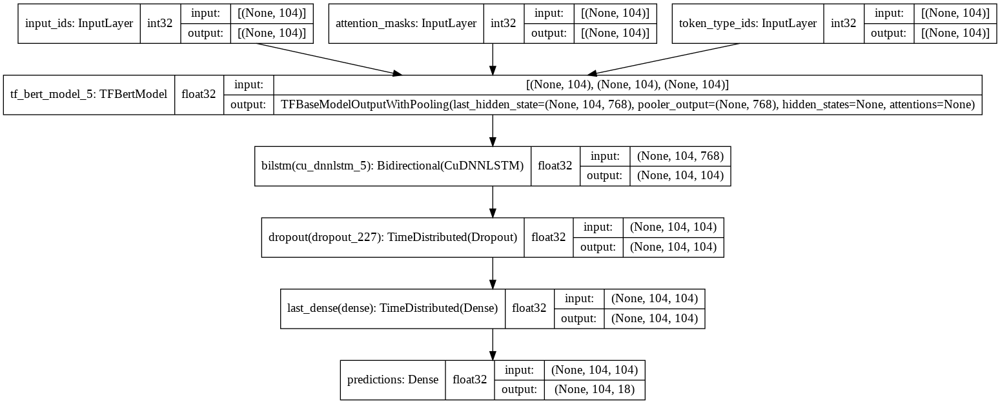

# BERT BISLTM - NER 

### 🚧 Em construção...

Feeding BILSTM with BERT Embeddings to finetuning model for NER Task.

---
## Keras Model

## Como contribuir

* Faça um fork desse repositório;
* Cria uma branch com a sua feature: `git checkout -b minha-feature` ;
* Faça commit das suas alterações: `git commit -m 'feat: Minha nova feature'` ;
* Faça push para a sua branch: `git push origin minha-feature` .

Depois que o merge da sua pull request for feito, você pode deletar a sua branch.

## Licença

A definir!

---

## Referências
* [Text Extraction with BERT](https://keras.io/examples/nlp/text_extraction_with_bert/)
* [Annotated Corpus for Named Entity Recognition](https://www.kaggle.com/abhinavwalia95/entity-annotated-corpus)
* [Huggingface - Transformers](https://github.com/huggingface/transformers)
* [The Illustrated BERT, ELMo, and co. (How NLP Cracked Transfer Learning)](http://jalammar.github.io/illustrated-bert/)
* [Neural Architectures for Named Entity Recognition](https://arxiv.org/abs/1603.01360)

---

Feito com 💜 by **mpgxc**
